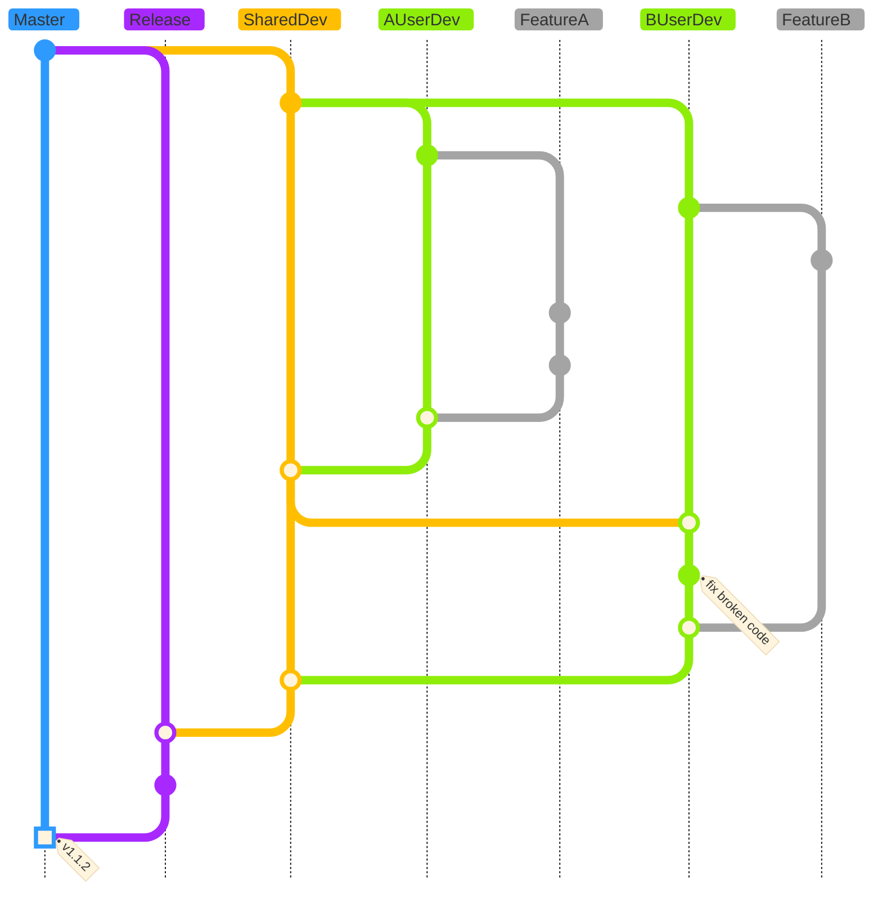
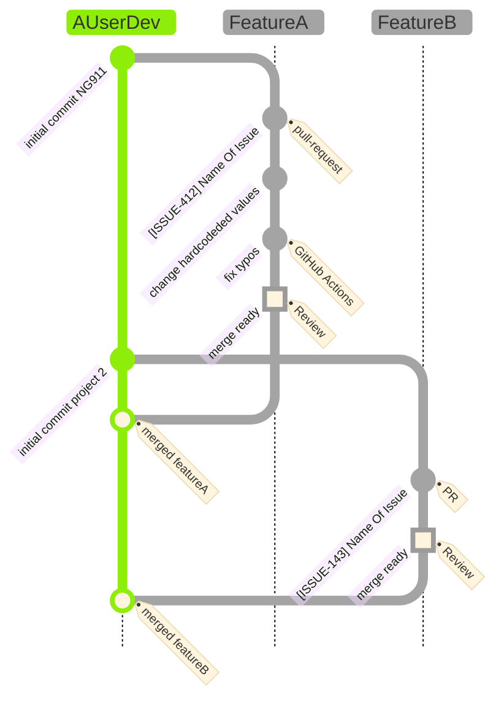
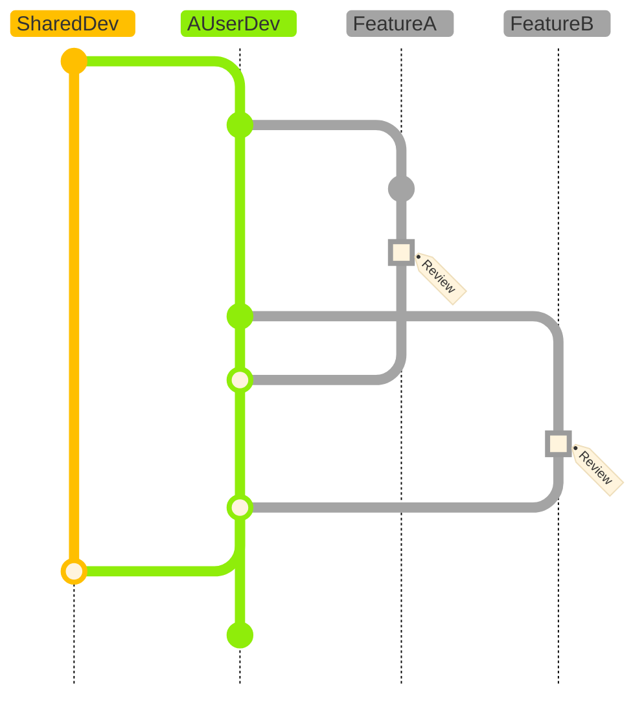
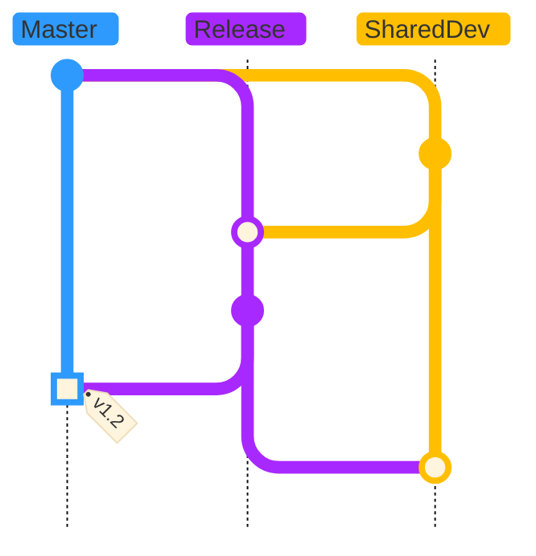

# INL Software Development Workflow

Our workflow is based on GitFlow, with both shared and personal development branches, release branches, and hotfix branches.

## What is GitFlow?

GitFlow is a branching model for Git, created by [Vincent Driessen.](https://nvie.com/posts/a-successful-git-branching-model/) 

## Key Features

### Parallel Development

One of the great things about GitFlow is that it makes parallel development very easy, by isolating new development from finished work. New development (such as features and non-emergency bug fixes) is done in feature branches and is only merged back into the development branch after going through extensive unit/regressional testing and review through the pull request mechanism.

### Collaboration

Feature branches also make it easier for developers to collaborate on the same feature, because each feature branch is essentially a sandbox where you isolate and test the changes that are only necessary to get a new feature working, making it clear what each collaborator is working on.

### Conflict Resolution

Developers who are working on code that will take an extended period of time to complete (likely composed of multiple issues/features) are able to maintain their personal development branches with code that may break others'. Each developer is responsible for resolving conflicts introduced by others' code before merging into the shared development branch.

### Release Staging Area

As new development is completed, it gets merged back into the development branch, which is a staging area for all completed features that haven't yet been released. So when the next release is branched off of development, it will automatically contain all of the new tasks that have been finished.

## How it Works

***ALL OF OUR DIAGRAMS READ FROM TOP TO BOTTOM***

The diagram below provides a high-level view of our workflow overall operation. The main points are:

* Shared and personal development branches are used.
* With the exception of hotfixes (described later and not shown in this diagram), the "master" branch is only updated when a release is to be made.
* Releases are made through creation of "release" branches. Release branches are used to resolve all conflicts and complete all testing before merging into "master" and producing a tagged release.
* Feature branches are associated with individual issues. They are merged into personal development branches.
* Users periodically check the shared development branch for changes since the last divergence of their personal development branch (i.e., how many commits behind are they). If there are any commits in the shared development branch that aren't in their personal one, they merge shared development into their personal branch. This should be done no less frequently than once every two weeks; better that it is done weekly.
* The above check ***must*** be done before merging a personal development branch into the shared development branch.
* Each user is responsible for resolving any conflicts or broken code resulting from the merge of shared development into their personal development branch. Of course, they can seek help from the code author.
* Basically, the personal development code must be working and passing all tests before it is merged into shared development. Since is should be up-to-date with shared development, the same will be true for shared development after a merge.
* Generally, after being merged into shared development, the personal development branch may be deleted.
* So, from that point of view, a personal development branch is like a "super feature branch", resolving multiple related issues that individually can't be merged into shared development because they don't leave the code in a "good" (or even working) state.
* The names shown below are mostly not what we actually call these branches; see below and our onboarding guide for naming conventions.

### High Level Overview of Our Process

### Feature branches

Our shared development branch is considered to be the main branch, in terms of being the latest functioning code (which may or may not be ready for merging into master and creating a release) and so is the source for creation of all personal development branches. So, all personal development branches start off as functioning code and are not merged back into the shared development branch until they are once again functioning code. Until then, features are branched off of the personal development and merged back into personal development (with pull requests, tests, and code reviews).

### Merging to Shared Development

The shared and personal development branches exist parallel to one another. We consider the shared development branch to be the main branch where the source code always reflects a state with the latest delivered development changes. The personal development branches, on the other hand, may be in a state in which the code is "broken", i.e., in the middle of a sequence of feature branch changes that will, incrementally, produce fully working code. So, one principle is that we don't merge code into the shared development branch until the associated line of development is complete. At that point, we double-check that the personal development branch isn't behind shared development and generate a pull request to merge it.

### Merging to Master and Making a Release

Once the shared development branch is ready to merge back to the master, we create a release branch. We then merge the shared development branch into the release branch, do final testing (including manual tests for GPU, etc.), fix any problems, merge into master, and create a release.

## Naming Conventions

* Shared development branch: "SharedDevelopment"
* Personal development branch: "*Name*Dev" or "*Name*Development", where "*name*" can be either the user's name or GitHub ID.
* Feature branch: "issue-*XXX*-*description*", where "*XXX*" is the corresponding issue number and "*description*" is the issue title (possibly shortened).
* Hotfix branches: "hotfix-issue-*XXX*-*description*"
* Release branches: "release-v*##*", where *##* is the anticipated release tag.
* Most pull requests: "[issue-*XXX*] *description*"
* Release pull requests: "Release *##*"

## Why are we doing this?

The information below is left-over details relating to how we used to do a release, when we only had one development branch and cherry-picked commits to merge into a release branch. Unfortunately, cherry picking doesn't preserve commit hashes, and so git eventually gets hopelessly confused about conflicts and merging into master then becomes very difficult.

The basic idea is to create a release branch off of `master`, then cherry pick the commits we want to incorporate into this release. So, first of all, we want to get a list of all of the commits in `development` that aren't in `master`:

    git log --no-merges development ^master > /tmp/nomerges.txt

You'll note that we exclude merge commits above. We then go through that file and delete the commits we don't want to incorporate into our release. Next, we extract just the lines that contain the commit IDs:

    grep commit /tmp/nomerges.txt > /tmp/commits.txt

These are in reverse order (newest to oldest); we'd like the list to be oldest to newest:

    tail -r /tmp/commits.txt > /tmp/revcommits.txt

And then we can use simple find/replace in a text editor (for example, in emacs) to create a shell script with lines that look like:

    git cherry-pick -x -X theirs f622b2c36f0f29472f366470cc2d054149ce4258

In principle, if our current branch is the release branch, this should induce git to cherry pick each commit into that branch, resolving any conflicts in favor of the incoming commit. We can test by copying and pasting a line or two from that file, then, if satisfied, just `sh /tmp/revcommits.txt`.

---------
[<< Go back to the Graphitti home page](../index.md)

[<< Go back to the CONTRIBUTING.md](https://github.com/UWB-Biocomputing/Graphitti/blob/master/CONTRIBUTING.md)
