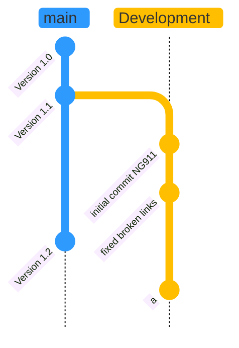
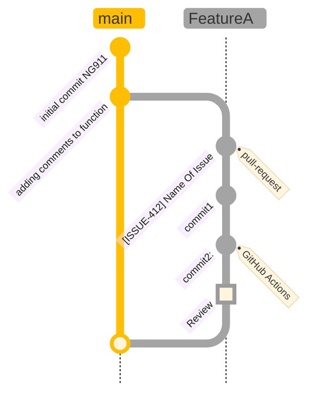
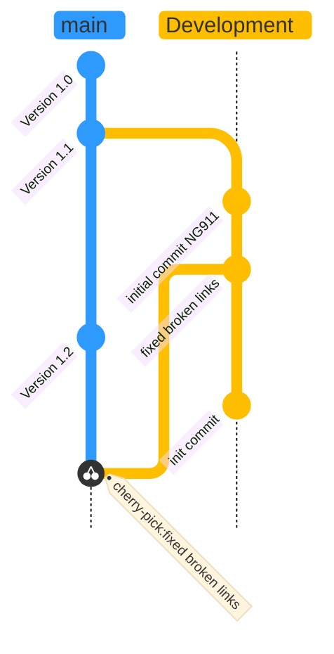

# Introducing GitFlow

## What is GitFlow?

GitFlow is a branching model for Git, created by [Vincent Driessen.](https://nvie.com/posts/a-successful-git-branching-model/) 

## Key Benefits

### Parallel Development
One of the great things about GitFlow is that it makes parallel devleopment very easy, by isolating new development from finished work. New development (such as features and non-emergency bug fixes) is done in feature branches, and is only merged back into development branch after going through extensive unit/regressional testing + review through the pull request.

Another great thing about GitFlow is that if you are asked to switched from one task to another, all you need to do is commit your changes and create a new branch for your new task. When that task is done, just checkout your original feature branch and you can continue where you left off.

### Collaboration
Feature branches also make it easier for developers to collaborate on the same feature, because each feature branch is essentially a sandbox where you isolate + test the changes that are only necessary to get a new feature working, making it crystal clear to follow what each collaborator is working on. 

### Release Staging Area
As new development is completed, it gets merged back into the development brach, which is a staging area for all completed features that haven't yet been released. So when the next release is branched off of development, it will automatically contain all of the new tasks that have been finished.

## How it Works
New development (new features, non-emergency bug fixes) are built in feature branches. These feature branches are branched off of the development branch, and finished features are merged back into the development branch when they're ready to be reviewed & merged.

### Main Branch

### Supporting branches

### Merging to Master Branch
Merging to the Master branch is kind of tricky for our workflow. Our master and development branch are parallel, meaning, that our development is technically the master branch. The feature branches that are created and destroyed branch off of the Development branch and once the changes are made it is not quite pushed to the Master branch.

---------
[<< Go back to the Graphitti home page](../index.md)

[<< Go back to the CONTRIBUTING.md](../../CONTRIBUTING.md)