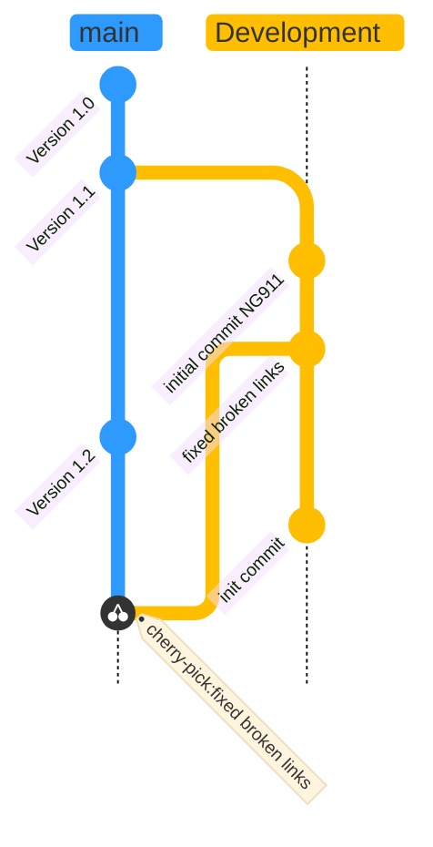

# Introducing GitFlow

## What is GitFlow?

GitFlow is a branching model for Git, created by [Vincent Driessen.](https://nvie.com/posts/a-successful-git-branching-model/) 

## Key Benefits

### Parallel Development
One of the great things about GitFlow is that it makes parallel devleopment very easy, by isolating new development from finished work. New development (such as features and non-emergency bug fixes) is done in feature branches and is only merged back into the development branch after going through extensive unit/regressional testing + review through the pull request.

Another great thing about GitFlow is that if you are asked to switch from one task to another, all you need to do is commit your changes and create a new branch for your new task. When that task is done, just checkout your original feature branch and you can continue where you left off.

### Collaboration
Feature branches also make it easier for developers to collaborate on the same feature, because each feature branch is essentially a sandbox where you isolate + test the changes that are only necessary to get a new feature working, making it crystal clear to follow what each collaborator is working on. 

### Release Staging Area
As new development is completed, it gets merged back into the development branch, which is a staging area for all completed features that haven't yet been released. So when the next release is branched off of development, it will automatically contain all of the new tasks that have been finished.

## How it Works
***ALL OF OUR DIAGRAMS READ FROM TOP TO BOTTOM***

### High Overview of Our Process

[](https://mermaid.live/edit#pako:eNqVksFuozAQhl_FmiryBUVAIAbfkm3ZS9tLqx4qLgN4CWqwI2Pa7SLevca022RbVV242J_n_2fsmQFKVQngsFgMjWwMJwOhe1Vfikexp5zQShR9TT1CzU60YiIFduIvuEPdYLEXnT0ZcknsR-vG-FPgWXiRbrIL6r3zwPEs22a-f8xDxzfR9B_z1THP5ehN8KfGw27KR7UyaMQP1baNucTCVWx0L2x13U49bTXKcudqO6In4b9w300HLTZyDr_G-ZpX2Bmh6TiScbHI5Vtecrvlrr7S2bhl4YTkfHozdWiFnLFNXT6o3pDZ6pR9CH63-y_da-5MoOm12Hzw-sT2i9SnbttvW7RC1-If2Se3mMNOxOCBpfb5KzuEboJycJOVA7fLCvVDDrbzNg57o26eZQncdRP6Q2W7f95grbGF11aCqBqj9NU81W64PTigvFeqfRPaLfABfgNfx0uWrMM4YmmSBHGYevAMfBUtA7ZmSRCkFsVJOHrwx-n9ZRqlPmNRyFYJC1csHl8A7fELNA)

### Feature branches
Our development branch is considered to be the main branch, where features are branched off of development and merged back into development.

[](https://mermaid.live/edit#pako:eNqtlE1vm0AQhv_KaCuLC7EMxsHmZpr6Q3KTKk57aOlhDWPYBli6LE5ci__eXWwaW7VVH8qKAw_z8c6MZnck5BESj3Q6O5Yz6cEOjJTHC9xganhgRLiqYsMEQyaYoSYrWuIf8IUKRlcplurPLshBPUbMZE8bvptM_EmvZ5hv3Gr42NHnmNvHPMhrU8OpoEWi4xqCSyrxPc8yJhd01SiTokKlokz4iy9oHiaNhiN6Yn7gGWX53vqe7qu504XyIsNcGnUNdafTqGrTw5Pv7WUChE1AYJEHAdHNYjRt4f10ZFkBaU1XTQ6YIJWVwPHZCN_my-XnDzeOZX8HrQYe1jAvywoDApLGXkCKKk1vBP6ssJRvsU-ChAnNY4SEikgPUh3Y0FQ5XLBfs1eQ24KXhyQKTZmcVSsYh5Lx_JJfhkKlEUijrfbcFujBbD6dLdT7dJD7iBuGL0cBEgyfeSXhqMfX9LIQ_AeGEuxL_fSvybBX3E6gLbahEazbwVwntv33V_4z87Sc_qV5fnr8d3fhv7T3pHj_fPG-DkVMTdVaROoOaBY4IM1iB0R7RFQ8a7Na2dFK8uU2D8l-mUhVRGop7xiNBc2It6ZpqShGTHLxcX-pNHeLSQqaf-U8ax3VJ_F25JV4t4OuO7y1B447Gg6tgT0yyZZ4fadrubfu0LJGCg2Gdm2SX41_rztyRj3XdWy3P3TtvjuofwOb-nzg)

### Merging to Master Branch
The master and development branches exist parallel to one another. We consider the development branch to be the main branch where the source code always reflects a state with the latest delivered development changes. Once the development branch is ready to merge back to the master, we create a release branch (not supported in our document). Our version can either cherry-pick the developments we want into the master or revert the changes and merge to the master and re-revert the changes (not supported in the document). 

<<<<<<< HEAD

---------
[<< Go back to the Graphitti home page](../index.md)

[<< Go back to the CONTRIBUTING.md](../../CONTRIBUTING.md)
=======
[](https://mermaid.live/edit#pako:eNqNVNFumzAU_RXLU8QLjQIhAfyWrEkaKe2kpevDxh4cuCFWACNj2tGIf58xZSNr1xTEg8-99_ici69POOQRYIIHgxPLmCTohIyExxt4hMQgyIhgV8aGiQx5gBQaZEcL-AM8UMHoLoFCRU5BhtRjxEyOmsRP9sKfLReG-Re3NL5czpejUR-3NT5zmrePj_-DO308yGoVauCVoPmhUWIILqmEzzxNmdzQnfYiRQlKd3HgT3NBs_CgVffQs_Q9TQowjZSyrM2-o63_W1pIEEZdo3owCLJuW3Q_J1pgqFkQiwgK8AOIgvEMWUMrwDq802Toumkwz1PIZFt1gPDIS_k60KdrfhGjSQferXzrH94lUFkKmL2u_bHebr8trhzL_okaL-jLHq2LooQXgrPkFEQMSACNqgAjWeVA0M16dbNR3z2SNCYB_gqPDJ666g_p14RIcsWcgDpHb2qfv0_YSut89vVGaN-5vySqC5xv2Up9yy3q7KJL1Gfy5h-U0Z6pnoguLER1lbPw-H7_LjQfm01_1EmO1KDrKQ2wnt4AN6QRFceGqFZ5tJR8W2UhJnoucJlHao6uGY0FTfHLUGCImOTitr059AVi4pxm3zlPu0K1xOSEf2EynQxdb2pPHNf3PGti-yauMBk7Q8udup5l-QqaeHZt4mddPxr6jj9yXcd2x55rj91J_Rvb4n0O)
>>>>>>> 34b9d9c59f50adbae5192b907d419e02d9b4f510
