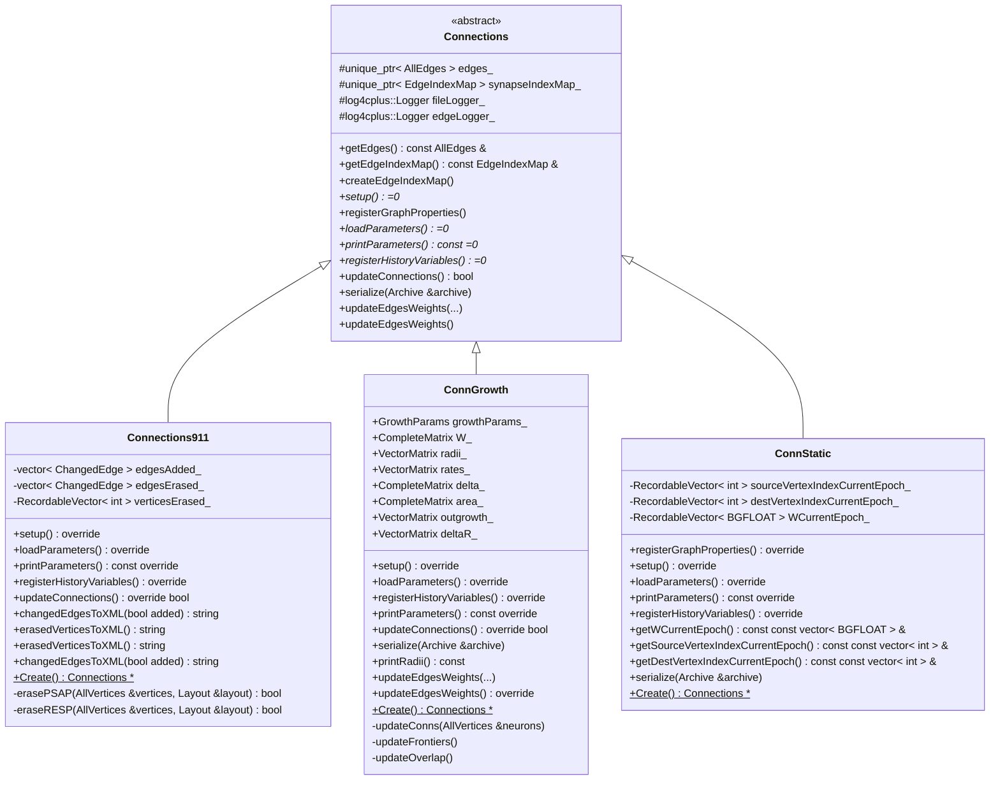
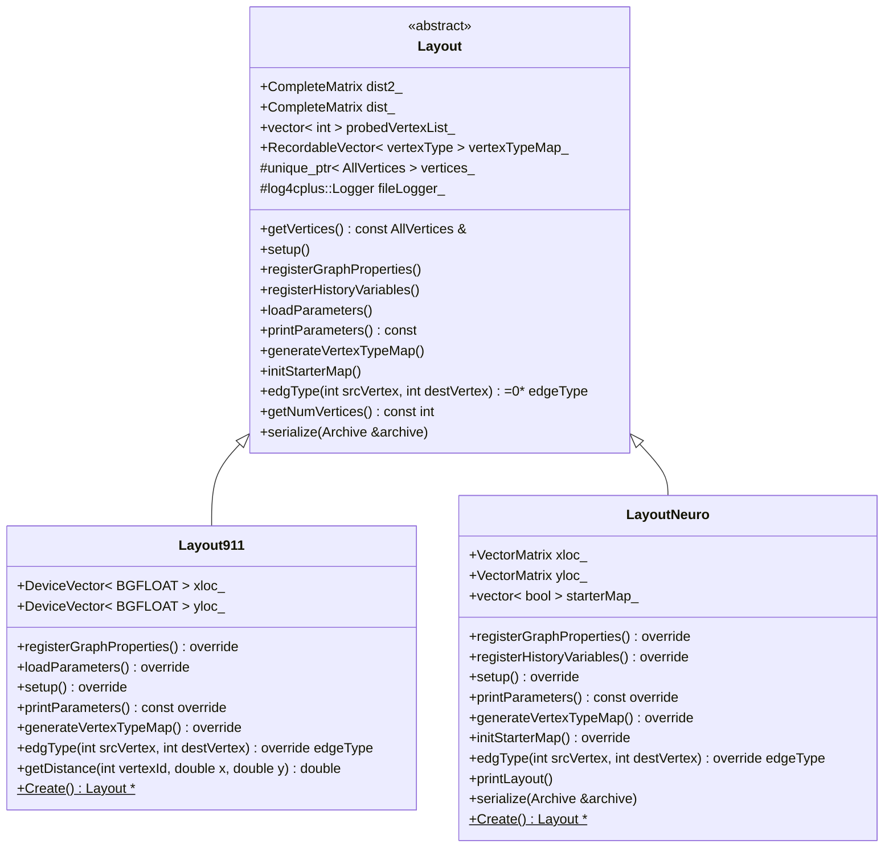
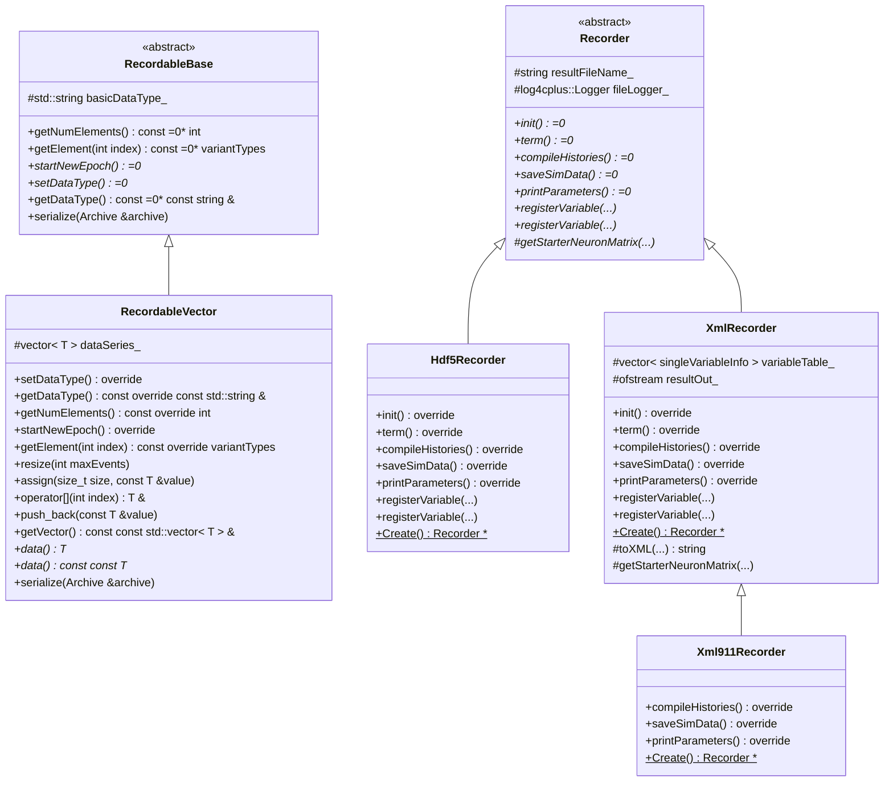

# UML Domain and Class Diagrams

## Graphitti Overview

```mermaid
%%{init: {'class': {'hideEmptyMembersBox': true}}}%%
classDiagram
namespace Core {
    class cls_Core["Core"]
    class cls_CPUModel["CPUModel"]
    %%%    class cls_EdgeIndexMap["EdgeIndexMap"]
    %%%    class cls_GenericFunctionNode["GenericFunctionNode"]
    class cls_GPUModel["GPUModel"]
    %%%    class cls_IFunctionNode["IFunctionNode"] {
    %%%    <<abstract>>
    %%% }
    class cls_Model["Model"] {
        <<abstract>>
    }
    class cls_OperationManager["OperationManager"] {
        <<singleton>>
    }
    class cls_ParameterManager["ParameterManager"] {
        <<singleton>>
    }
    class cls_GraphManager["GraphManager"] {
        <<singleton>>
    }
    class cls_Serializer["Serializer"]
    class cls_Simulator["Simulator"] {
        <<singleton>>
    }
    %%%    class cls_TwoUint64ArgFunctionNode["TwoUint64ArgFunctionNode"]
}
namespace Connections {
    class cls_Connections["Connections"] {
        <<abstract>>
    }
    class cls_Connections911["Connections911"]
    class cls_ConnGrowth["ConnGrowth"]
    class cls_ConnStatic["ConnStatic"]
}
namespace Layout {
    class cls_Layout["Layout"] {
        <<abstract>>
    }
    class cls_Layout911["Layout911"]
    class cls_LayoutNeuro["LayoutNeuro"]
}
namespace Edges {
    class cls_All911Edges["All911Edges"]
    class cls_AllDSSynapses["AllDSSynapses"]
    class cls_AllDynamicSTDPSynapses["AllDynamicSTDPSynapses"]
    class cls_AllEdges["AllEdges"] {
        <<abstract>>
    }
    class cls_AllNeuroEdges["AllNeuroEdges"] {
        <<abstract>>
    }
    class cls_AllSpikingSynapses["AllSpikingSynapses"]
    class cls_AllSTDPSynapses["AllSTDPSynapses"]
}
namespace Vertices {
    class cls_All911Vertices["All911Vertices"]
    class cls_AllIFNeurons["AllIFNeurons"]
    class cls_AllIZHNeurons["AllIZHNeurons"]
    class cls_AllLIFNeurons["AllLIFNeurons"]
    class cls_AllSpikingNeurons["AllSpikingNeurons"] {
        <<abstract>>
    }
    class cls_AllVertices["AllVertices"] {
        <<abstract>>
    }
    class cls_EventBuffer["EventBuffer"]
}
namespace Recorders {
    class cls_Hdf5Recorder["Hdf5Recorder"]
    class cls_RecordableBase["RecordableBase"] {
        <<abstract>>
    }
    class cls_RecordableVector["RecordableVector"]
    class cls_Recorder["Recorder"] {
        <<abstract>>
    }
    class cls_Xml911Recorder["Xml911Recorder"]
    class cls_XmlRecorder["XmlRecorder"]
}
%%% Inheritance
cls_AllEdges <|-- cls_All911Edges
cls_AllVertices <|-- cls_All911Vertices
cls_AllSpikingSynapses <|-- cls_AllDSSynapses
cls_AllSTDPSynapses <|-- cls_AllDynamicSTDPSynapses
cls_AllSpikingNeurons <|-- cls_AllIFNeurons
cls_AllIFNeurons <|-- cls_AllIZHNeurons
cls_AllIFNeurons <|-- cls_AllLIFNeurons
cls_AllEdges <|-- cls_AllNeuroEdges
cls_AllVertices <|-- cls_AllSpikingNeurons
cls_AllNeuroEdges <|-- cls_AllSpikingSynapses
cls_AllSpikingSynapses <|-- cls_AllSTDPSynapses
cls_Connections <|-- cls_Connections911
cls_Connections <|-- cls_ConnGrowth
cls_Connections <|-- cls_ConnStatic
cls_Model <|-- cls_CPUModel
%%% cls_IFunctionNode <|-- cls_GenericFunctionNode
cls_Model <|-- cls_GPUModel
cls_Recorder <|-- cls_Hdf5Recorder
cls_Layout <|-- cls_Layout911
cls_Layout <|-- cls_LayoutNeuro
cls_RecordableBase <|-- cls_RecordableVector
%%% cls_IFunctionNode <|-- cls_TwoUint64ArgFunctionNode
cls_XmlRecorder <|-- cls_Xml911Recorder
cls_Recorder <|-- cls_XmlRecorder
%%% Composition
cls_Model o-- cls_Layout
cls_Model o-- cls_Connections
cls_Model o-- cls_Recorder
cls_Simulator o-- cls_Model
cls_Layout o-- cls_AllVertices
cls_Connections o-- cls_AllEdges
%%% Other relationships
cls_Core --> cls_Simulator : gets singleton
cls_Core --> cls_ParameterManager : gets singleton
cls_Core --> cls_OperationManager : gets singleton
cls_Core --> cls_GraphManager : gets singleton
```



### Graphitti Class Diagram

```mermaid
%%{init: {'class': {'hideEmptyMembersBox': true}}}%%
classDiagram
namespace Core {
    class cls_Core["Core"] {
        +runSimulation(...) int
        -parseCommandLine(...) bool
    }
    class cls_CPUModel["CPUModel"] {
        +finish() override
        +advance() override
        +updateConnections() override
        +copyGPUtoCPU() override
        +copyCPUtoGPU() override
    }
    class cls_EdgeIndexMap["EdgeIndexMap"] {
        +vector~ BGSIZE ~ outgoingEdgeIndexMap_
        +vector~ BGSIZE ~ outgoingEdgeBegin_
        +vector~ BGSIZE ~ outgoingEdgeCount_
        +vector~ BGSIZE ~ incomingEdgeIndexMap_
        +vector~ BGSIZE ~ incomingEdgeBegin_
        +vector~ BGSIZE ~ incomingEdgeCount_
        +serialize(Archive &archive)
    }
%%%    class cls_GenericFunctionNode["GenericFunctionNode"] {
%%%        -std::function~ void()~ function_
%%%        +invokeFunction(const Operations &operation) const override bool
%%%        +invokeFunction(...) bool
%%%    }
    class cls_GPUModel["GPUModel"] {
        +setupSim() override
        +finish() override
        +advance() override
        +updateConnections() override
        +copyCPUtoGPU() override
        +copyGPUtoCPU() override
        +printGPUEdgesPropsModel() const
        +getAllEdgesDevice() AllEdgesDeviceProperties *&
        +getAllVerticesDevice() AllVerticesDeviceProperties *&
        #allocDeviceStruct()
        #deleteDeviceStruct()
        #roundUpNumberOfNoiseElements(int input) int
        -allocEdgeIndexMap(int count)
        -updateHistory()
        -eraseEdge(AllEdges &edges, int vertexIndex, int edgeIndex)
        -addEdge(...)
        -createEdge(...)
    }
%%%    class cls_IFunctionNode["IFunctionNode"] {
%%%        <<abstract>>
%%%        #Operations operationType_
%%%        +invokeFunction(const Operations &operation) const =0* bool
%%%        +invokeFunction(...)* bool
%%%    }
    class cls_Model["Model"] {
        <<abstract>>
        #unique_ptr~ Connections ~ connections_
        #unique_ptr~ Layout ~ layout_
        #unique_ptr~ Recorder ~ recorder_
        #log4cplus::Logger fileLogger_
        +getConnections() const Connections &
        +getLayout() const Layout &
        +getRecorder() const Recorder &
        +saveResults()
        +setupSim()
        +finish()=0*
        +updateHistory()
        +advance()=0*
        +updateConnections()=0*
        +serialize(Archive &archive, std::uint32_t const version)
        #copyGPUtoCPU()=0*
        #copyCPUtoGPU()=0*
        #createAllVertices()
    }
    class cls_OperationManager["OperationManager"] {
        -list~ unique_ptr~ IFunctionNode ~ ~ functionList_
        -log4cplus::Logger logger_
        +getInstance()$ OperationManager &
        +registerOperation(...)
        +registerOperation(...)
        +executeOperation(const Operations &operation) const
        +executeOperation(...)
        +operationToString(const Operations &operation) const string
        +operator=(const OperationManager &operationManager)=delete OperationManager &
        +operator=(OperationManager &&operationManager)=delete OperationManager &
    }
    class cls_Serializer["Serializer"] {
        +serialize()
        +deserialize() bool
        -processArchive(Archive &archive, Simulator &simulator)$ bool
    }
    class cls_Simulator["Simulator"] {
        +getInstance()$ Simulator &
        +setup()
        +finish()
        +loadParameters()
        +printParameters() const
        +reset()
        +simulate()
        +advanceEpoch(int currentEpoch) const
        +saveResults() const
        +instantiateSimulatorObjects() bool
    }
%%%    class cls_TwoUint64ArgFunctionNode["TwoUint64ArgFunctionNode"] {
%%%        -std::function~ void(uint64_t, uint64_t)~ function_
%%%        +invokeFunction(const Operations &operation) const bool
%%%        +invokeFunction(...) bool
%%%    }
}
namespace Connections {
    class cls_Connections["Connections"] {
        <<abstract>>
        #unique_ptr~ AllEdges ~ edges_
        #unique_ptr~ EdgeIndexMap ~ synapseIndexMap_
        #log4cplus::Logger fileLogger_
        #log4cplus::Logger edgeLogger_
        +getEdges() const AllEdges &
        +getEdgeIndexMap() const EdgeIndexMap &
        +createEdgeIndexMap()
        +setup()=0*
        +registerGraphProperties()
        +loadParameters()=0*
        +printParameters() const =0*
        +registerHistoryVariables()=0*
        +updateConnections() bool
        +serialize(Archive &archive)
        +updateEdgesWeights(...)
        +updateEdgesWeights()
    }
    class cls_Connections911["Connections911"] {
        -vector~ ChangedEdge ~ edgesAdded_
        -vector~ ChangedEdge ~ edgesErased_
        -RecordableVector~ int ~ verticesErased_
        +setup() override
        +loadParameters() override
        +printParameters() const override
        +registerHistoryVariables() override
        +updateConnections() override bool
        +changedEdgesToXML(bool added) string
        +erasedVerticesToXML() string
        +erasedVerticesToXML() string
        +changedEdgesToXML(bool added) string
        +Create()$ Connections *
        -erasePSAP(AllVertices &vertices, Layout &layout) bool
        -eraseRESP(AllVertices &vertices, Layout &layout) bool
    }
    class cls_ConnGrowth["ConnGrowth"] {
        +GrowthParams growthParams_
        +CompleteMatrix W_
        +VectorMatrix radii_
        +VectorMatrix rates_
        +CompleteMatrix delta_
        +CompleteMatrix area_
        +VectorMatrix outgrowth_
        +VectorMatrix deltaR_
        +setup() override
        +loadParameters() override
        +registerHistoryVariables() override
        +printParameters() const override
        +updateConnections() override bool
        +serialize(Archive &archive)
        +printRadii() const
        +updateEdgesWeights(...)
        +updateEdgesWeights() override
        +Create()$ Connections *
        -updateConns(AllVertices &neurons)
        -updateFrontiers()
        -updateOverlap()
    }
    class cls_ConnStatic["ConnStatic"] {
        -RecordableVector~ int ~ sourceVertexIndexCurrentEpoch_
        -RecordableVector~ int ~ destVertexIndexCurrentEpoch_
        -RecordableVector~ BGFLOAT ~ WCurrentEpoch_
        +registerGraphProperties() override
        +setup() override
        +loadParameters() override
        +printParameters() const override
        +registerHistoryVariables() override
        +getWCurrentEpoch() const const vector~ BGFLOAT ~ &
        +getSourceVertexIndexCurrentEpoch() const const vector~ int ~ &
        +getDestVertexIndexCurrentEpoch() const const vector~ int ~ &
        +serialize(Archive &archive)
        +Create()$ Connections *
    }
}
namespace Layout {
    class cls_Layout["Layout"] {
        <<abstract>>
        +CompleteMatrix dist2_
        +CompleteMatrix dist_
        +vector~ int ~ probedVertexList_
        +RecordableVector~ vertexType ~ vertexTypeMap_
        #unique_ptr~ AllVertices ~ vertices_
        #log4cplus::Logger fileLogger_
        +getVertices() const AllVertices &
        +setup()
        +registerGraphProperties()
        +registerHistoryVariables()
        +loadParameters()
        +printParameters() const
        +generateVertexTypeMap()
        +initStarterMap()
        +edgType(int srcVertex, int destVertex)=0* edgeType
        +getNumVertices() const int
        +serialize(Archive &archive)
    }
    class cls_Layout911["Layout911"] {
        +DeviceVector~ BGFLOAT ~ xloc_
        +DeviceVector~ BGFLOAT ~ yloc_
        +registerGraphProperties() override
        +loadParameters() override
        +setup() override
        +printParameters() const override
        +generateVertexTypeMap() override
        +edgType(int srcVertex, int destVertex) override edgeType
        +getDistance(int vertexId, double x, double y) double
        +Create()$ Layout *
    }
    class cls_LayoutNeuro["LayoutNeuro"] {
        +VectorMatrix xloc_
        +VectorMatrix yloc_
        +vector~ bool ~ starterMap_
        +registerGraphProperties() override
        +registerHistoryVariables() override
        +setup() override
        +printParameters() const override
        +generateVertexTypeMap() override
        +initStarterMap() override
        +edgType(int srcVertex, int destVertex) override edgeType
        +printLayout()
        +serialize(Archive &archive)
        +Create()$ Layout *
    }
}
namespace Edges {
    class cls_All911Edges["All911Edges"] {
        +vector~ unsigned char ~ isAvailable_
        +vector~ unsigned char ~ isRedial_
        +vector~ Call ~ call_
        +setupEdges() override
        +createEdge(...)
        +allocEdgeDeviceStruct() override
        +allocEdgeDeviceStruct(...)
        +deleteEdgeDeviceStruct() override
        +copyEdgeHostToDevice() override
        +copyEdgeHostToDevice(...)
        +copyEdgeDeviceToHost() override
        +copyDeviceEdgeCountsToHost(void *allEdgesDevice) override
        +advanceEdges(...)
        +setAdvanceEdgesDeviceParams() override
        +printGPUEdgesProps(void *allEdgesDeviceProps) const override
        +advanceEdges(...)
        +advance911Edge(BGSIZE iEdg, All911Vertices &vertices)
        +advanceEdge(BGSIZE iEdg, AllVertices &vertices) override
        +Create()$ AllEdges *
        #allocDeviceStruct(...)
        #deleteDeviceStruct(All911EdgesDeviceProperties &allEdgesDeviceProps)
        #copyHostToDevice(...)
        #copyDeviceToHost(All911EdgesDeviceProperties &allEdgesDeviceProps)
    }
    class cls_AllDSSynapses["AllDSSynapses"] {
        +vector~ uint64_t ~ lastSpike_
        +vector~ BGFLOAT ~ r_
        +vector~ BGFLOAT ~ u_
        +vector~ BGFLOAT ~ D_
        +vector~ BGFLOAT ~ U_
        +vector~ BGFLOAT ~ F_
        +setupEdges() override
        +resetEdge(BGSIZE iEdg, BGFLOAT deltaT) override
        +printParameters() const override
        +createEdge(...)
        +printSynapsesProps() const override
        +serialize(Archive &archive)
        +allocEdgeDeviceStruct() override
        +allocEdgeDeviceStruct(...)
        +deleteEdgeDeviceStruct() override
        +copyEdgeHostToDevice() override
        +copyEdgeHostToDevice(...)
        +copyEdgeDeviceToHost() override
        +setEdgeClassID() override
        +printGPUEdgesProps(void *allEdgesDeviceProps) const override
        +Create()$ AllEdges *
        #setupEdges(int numVertices, int maxEdges) override
        #readEdge(istream &input, BGSIZE iEdg) override
        #writeEdge(ostream &output, BGSIZE iEdg) const override
        #allocDeviceStruct(...)
        #deleteDeviceStruct(...)
        #copyHostToDevice(...)
        #copyDeviceToHost(...)
        #changePSR(BGSIZE iEdg, BGFLOAT deltaT) override
    }
    class cls_AllDynamicSTDPSynapses["AllDynamicSTDPSynapses"] {
        +vector~ uint64_t ~ lastSpike_
        +vector~ BGFLOAT ~ r_
        +vector~ BGFLOAT ~ u_
        +vector~ BGFLOAT ~ D_
        +vector~ BGFLOAT ~ U_
        +vector~ BGFLOAT ~ F_
        +setupEdges() override
        +resetEdge(BGSIZE iEdg, BGFLOAT deltaT) override
        +printParameters() const override
        +createEdge(...)
        +printSynapsesProps() const override
        +serialize(Archive &archive)
        +allocEdgeDeviceStruct() override
        +allocEdgeDeviceStruct(...)
        +deleteEdgeDeviceStruct() override
        +copyEdgeHostToDevice() override
        +copyEdgeHostToDevice(...)
        +copyEdgeDeviceToHost() override
        +setEdgeClassID() override
        +printGPUEdgesProps(void *allEdgesDeviceProps) const override
        +Create()$ AllEdges *
        #setupEdges(int numVertices, int maxEdges) override
        #readEdge(istream &input, BGSIZE iEdg) override
        #writeEdge(ostream &output, BGSIZE iEdg) const override
        #allocDeviceStruct(...)
        #deleteDeviceStruct(...)
        #copyHostToDevice(...)
        #copyDeviceToHost(...)
        #changePSR(BGSIZE iEdg, BGFLOAT deltaT)
    }
    class cls_AllEdges["AllEdges"] {
        <<abstract>>
        #log4cplus::Logger fileLogger_
        #log4cplus::Logger edgeLogger_
        +vector~ int ~ sourceVertexIndex_
        +vector~ int ~ destVertexIndex_
        +vector~ BGFLOAT ~ W_
        +vector~ edgeType ~ type_
        +vector~ unsigned char ~ inUse_
        +vector~ BGSIZE ~ edgeCounts_
        +setupEdges()
        +loadParameters()
        +printParameters() const
        +addEdge(...) BGSIZE
        +createEdge(...)*
        +createEdgeIndexMap(EdgeIndexMap &edgeIndexMap)
        +serialize(Archive &archive)
        +allocEdgeDeviceStruct()=0*
        +allocEdgeDeviceStruct(...)*
        +deleteEdgeDeviceStruct()=0*
        +copyEdgeHostToDevice()=0*
        +copyEdgeHostToDevice(...)*
        +copyEdgeDeviceToHost()=0*
        +copyDeviceEdgeCountsToHost(void *allEdgesDevice)=0*
        +advanceEdges(...)*
        +setAdvanceEdgesDeviceParams()=0*
        +printGPUEdgesProps(void *allEdgesDeviceProps) const =0*
        +advanceEdges(...)
        +advanceEdge(BGSIZE iEdg, AllVertices &vertices)=0*
        +eraseEdge(int vertexIndex, BGSIZE iEdg)
        #setupEdges(int numVertices, int maxEdges)
        #readEdge(istream &input, BGSIZE iEdg)
        #writeEdge(ostream &output, BGSIZE iEdg) const
        #edgeOrdinalToType(int typeOrdinal) edgeType
    }
    class cls_AllNeuroEdges["AllNeuroEdges"] {
        <<abstract>>
        +vector~ BGFLOAT ~ psr_
        +setupEdges() override
        +resetEdge(BGSIZE iEdg, BGFLOAT deltaT)
        +edgSign(const edgeType type) int
        +printSynapsesProps() const
        +serialize(Archive &archive)
        +outputWeights(int epochNum)=0*
        +setEdgeClassID()=0*
        #setupEdges(int numVertices, int maxEdges) override
        #readEdge(istream &input, BGSIZE iEdg) override
        #writeEdge(ostream &output, BGSIZE iEdg) const override
    }
    class cls_AllSpikingSynapses["AllSpikingSynapses"] {
        +vector~ BGFLOAT ~ decay_
        +vector~ BGFLOAT ~ tau_
        +vector~ int ~ totalDelay_
        +vector~ uint32_t ~ delayQueue_
        +vector~ int ~ delayIndex_
        +vector~ int ~ delayQueueLength_
        +setupEdges() override
        +resetEdge(BGSIZE iEdg, BGFLOAT deltaT) override
        +loadParameters() override
        +printParameters() const override
        +createEdge(...)
        +allowBackPropagation() bool
        +printSynapsesProps() const
        +serialize(Archive &archive)
        +outputWeights(int epochNum)
        +allocEdgeDeviceStruct() override
        +allocEdgeDeviceStruct(...)
        +deleteEdgeDeviceStruct() override
        +copyEdgeHostToDevice() override
        +copyEdgeHostToDevice(...)
        +copyEdgeDeviceToHost() override
        +copyDeviceEdgeCountsToHost(void *allEdgesDevice) override
        +advanceEdges(...)
        +setAdvanceEdgesDeviceParams() override
        +setEdgeClassID() override
        +printGPUEdgesProps(void *allEdgesDeviceProps) const override
        +copyDeviceEdgeSumIdxToHost(void *allEdgesDevice)
        +copyDeviceEdgeWeightsToHost(void *allEdgesDevice)
        +advanceEdge(BGSIZE iEdg, AllVertices &neurons) override
        +preSpikeHit(BGSIZE iEdg)
        +postSpikeHit(BGSIZE iEdg)
        +Create()$ AllEdges *
        #setupEdges(int numVertices, int maxEdges)
        #initSpikeQueue(BGSIZE iEdg)
        #updateDecay(BGSIZE iEdg, BGFLOAT deltaT) bool
        #readEdge(istream &input, BGSIZE iEdg) override
        #writeEdge(ostream &output, BGSIZE iEdg) const override
        #allocDeviceStruct(...)
        #deleteDeviceStruct(...)
        #copyHostToDevice(...)
        #copyDeviceToHost(...)
        #isSpikeQueue(BGSIZE iEdg) bool
        #changePSR(BGSIZE iEdg, BGFLOAT deltaT)
    }
    class cls_AllSTDPSynapses["AllSTDPSynapses"] {
        +vector~ int ~ totalDelayPost_
        +vector~ uint32_t ~ delayQueuePost_
        +vector~ int ~ delayIndexPost_
        +vector~ int ~ delayQueuePostLength_
        +vector~ BGFLOAT ~ tauspost_
        +vector~ BGFLOAT ~ tauspre_
        +vector~ BGFLOAT ~ taupos_
        +vector~ BGFLOAT ~ tauneg_
        +vector~ BGFLOAT ~ STDPgap_
        +vector~ BGFLOAT ~ Wex_
        +vector~ BGFLOAT ~ Aneg_
        +vector~ BGFLOAT ~ Apos_
        +vector~ BGFLOAT ~ mupos_
        +vector~ BGFLOAT ~ muneg_
        +setupEdges() override
        +resetEdge(BGSIZE iEdg, BGFLOAT deltaT) override
        +allowBackPropagation() override bool
        +loadParameters() override
        +printParameters() const override
        +createEdge(...)
        +printSynapsesProps() const override
        +serialize(Archive &archive)
        +allocEdgeDeviceStruct() override
        +allocEdgeDeviceStruct(...)
        +deleteEdgeDeviceStruct() override
        +copyEdgeHostToDevice() override
        +copyEdgeHostToDevice(...)
        +copyEdgeDeviceToHost() override
        +advanceEdges(...)
        +setEdgeClassID() override
        +printGPUEdgesProps(void *allEdgesDeviceProps) const override
        +advanceEdge(BGSIZE iEdg, AllVertices &neurons) override
        +postSpikeHit(BGSIZE iEdg) override
        +Create()$ AllEdges *
        #setupEdges(int numVertices, int maxEdges) override
        #readEdge(istream &input, BGSIZE iEdg) override
        #writeEdge(ostream &output, BGSIZE iEdg) const override
        #initSpikeQueue(BGSIZE iEdg) override
        #allocDeviceStruct(...)
        #deleteDeviceStruct(AllSTDPSynapsesDeviceProperties &allEdgesDevice)
        #copyHostToDevice(...)
        #copyDeviceToHost(AllSTDPSynapsesDeviceProperties &allEdgesDevice)
        #isSpikeQueuePost(BGSIZE iEdg) bool
        #synapticWeightModification(BGSIZE iEdg, BGFLOAT edgeWeight, double delta) BGFLOAT
        -stdpLearning(...)
    }
}
namespace Vertices {
    class cls_All911Vertices["All911Vertices"] {
        +vector~ int ~ vertexType_
        +vector~ EventBuffer~ uint64_t ~ ~ beginTimeHistory_
        +vector~ EventBuffer~ uint64_t ~ ~ answerTimeHistory_
        +vector~ EventBuffer~ uint64_t ~ ~ endTimeHistory_
        +vector~ EventBuffer~ uint64_t ~ ~ wasAbandonedHistory_
        +vector~ EventBuffer~ uint64_t ~ ~ queueLengthHistory_
        +vector~ EventBuffer~ float ~ ~ utilizationHistory_
        +vector~ CircularBuffer~ Call ~ ~ vertexQueues_
        +RecordableVector~ int ~ droppedCalls_
        +RecordableVector~ int ~ receivedCalls_
        +vector~ int ~ busyServers_
        +RecordableVector~ int ~ numServers_
        +RecordableVector~ int ~ numTrunks_
        +vector~ vector~ Call ~ ~ servingCall_
        +vector~ vector~ uint64_t ~ ~ answerTime_
        +vector~ vector~ int ~ ~ serverCountdown_
        +InputManager~ Call ~ inputManager_
        +vector~ int ~ vertexIdToNoiseIndex_
        +setupVertices() override
        +createAllVertices(Layout &layout)
        +loadParameters()
        +printParameters() const override
        +toString(int index) const string
        +loadEpochInputsToVertices(uint64_t currentStep, uint64_t endStep) override
        +registerHistoryVariables() override
        +getQueue(int vIdx) CircularBuffer~ Call ~ &
        +droppedCalls(int vIdx) int &
        +receivedCalls(int vIdx) int &
        +busyServers(int vIdx) const int
        +allocVerticesDeviceStruct() override
        +deleteVerticesDeviceStruct() override
        +copyToDevice() override
        +copyFromDevice() override
        +advanceVertices(...)
        +setAdvanceVerticesDeviceParams(AllEdges &edges) override
        +clearVertexHistory(void *allVerticesDevice) override
        +integrateVertexInputs(...)
        +copyEpochInputsToDevice() override
        +getNumberOfVerticesNeedingDeviceNoise() const override int
        +advanceVertices(...)
        +integrateVertexInputs(...)
        +Create()$ AllVertices *
        #getEdgeToClosestResponder(const Call &call, BGSIZE vertexIdx) BGSIZE
        #allocDeviceStruct(...)
        #deleteDeviceStruct(...)
        #copyVertexQueuesToDevice(...)
        #copyVertexQueuesFromDevice(...)
        #copyServingCallToDevice(...)
        #copyServingCallFromDevice(...)
        -advanceCALR(...)
        -advancePSAP(...)
        -advanceRESP(...)
    }
    class cls_AllIFNeurons["AllIFNeurons"] {
        +DeviceVector~ BGFLOAT ~ Trefract_
        +DeviceVector~ BGFLOAT ~ Vthresh_
        +DeviceVector~ BGFLOAT ~ Vrest_
        +DeviceVector~ BGFLOAT ~ Vreset_
        +DeviceVector~ BGFLOAT ~ Vinit_
        +DeviceVector~ BGFLOAT ~ Cm_
        +DeviceVector~ BGFLOAT ~ Rm_
        +DeviceVector~ BGFLOAT ~ Inoise_
        +DeviceVector~ BGFLOAT ~ Iinject_
        +DeviceVector~ BGFLOAT ~ Isyn_
        +DeviceVector~ int ~ numStepsInRefractoryPeriod_
        +DeviceVector~ BGFLOAT ~ C1_
        +DeviceVector~ BGFLOAT ~ C2_
        +DeviceVector~ BGFLOAT ~ I0_
        +DeviceVector~ BGFLOAT ~ Vm_
        +DeviceVector~ BGFLOAT ~ Tau_
        +setupVertices() override
        +loadParameters()
        +printParameters() const
        +createAllVertices(Layout &layout)
        +toString(int index) const string
        +deserialize(istream &input)
        +serialize(ostream &output) const
        +serialize(Archive &archive)
        +advanceVertices(...)
        +allocVerticesDeviceStruct()
        +deleteVerticesDeviceStruct()
        +clearVertexHistory(void *allVerticesDevice) override
        +copyFromDevice() override
        +copyToDevice() override
        #allocDeviceStruct(AllIFNeuronsDeviceProperties &allVerticesDevice)
        #deleteDeviceStruct(AllIFNeuronsDeviceProperties &allVerticesDevice)
        #copyDeviceToHost(AllIFNeuronsDeviceProperties &allVerticesDevice)
        #createNeuron(int neuronIndex, Layout &layout)
        #setNeuronDefaults(int index)
        #initNeuronConstsFromParamValues(int neuronIndex, BGFLOAT deltaT)
        #readNeuron(istream &input, int i)
        #writeNeuron(ostream &output, int i) const
    }
    class cls_AllIZHNeurons["AllIZHNeurons"] {
        +DeviceVector~ BGFLOAT ~ Aconst_
        +DeviceVector~ BGFLOAT ~ Bconst_
        +DeviceVector~ BGFLOAT ~ Cconst_
        +DeviceVector~ BGFLOAT ~ Dconst_
        +DeviceVector~ BGFLOAT ~ u_
        +DeviceVector~ BGFLOAT ~ C3_
        +setupVertices() override
        +printParameters() const override
        +createAllVertices(Layout &layout) override
        +toString(int index) const override string
        +deserialize(istream &input) override
        +serialize(ostream &output) const override
        +serialize(Archive &archive)
        +advanceVertices(...)
        +allocVerticesDeviceStruct() override
        +deleteVerticesDeviceStruct() override
        +clearVertexHistory(void *allVerticesDevice) override
        +copyFromDevice() override
        +copyToDevice() override
        +Create()$ AllVertices *
        #allocDeviceStruct(AllIZHNeuronsDeviceProperties &allVerticesDevice)
        #deleteDeviceStruct(AllIZHNeuronsDeviceProperties &allVerticesDevice)
        #copyHostToDevice(AllIZHNeuronsDeviceProperties &allVerticesDevice)
        #copyDeviceToHost(AllIZHNeuronsDeviceProperties &allVerticesDevice)
        #advanceNeuron(int index)
        #fire(int index)
        #createNeuron(int neuronIndex, Layout &layout)
        #setNeuronDefaults(int index)
        #initNeuronConstsFromParamValues(int neuronIndex, BGFLOAT deltaT) override
        #readNeuron(istream &input, int index)
        #writeNeuron(ostream &output, int index) const
    }
    class cls_AllLIFNeurons["AllLIFNeurons"] {
        +printParameters() const override
        +serialize(Archive &archive)
        +advanceVertices(...)
        +Create()$ AllVertices *
        #advanceNeuron(int index)
        #fire(int index)
    }
    class cls_AllSpikingNeurons["AllSpikingNeurons"] {
        <<abstract>>
        +DeviceVector~ bool ~ hasFired_
        +vector~ EventBuffer~ uint64_t ~ ~ vertexEvents_
        +DeviceVector~ BGFLOAT ~ summationPoints_
        +setupVertices() override
        +clearSpikeCounts()
        +registerHistoryVariables() override
        +serialize(Archive &archive)
        +setAdvanceVerticesDeviceParams(AllEdges &synapses)
        +copyFromDevice() override
        +copyToDevice() override
        +integrateVertexInputs(...)
        +advanceVertices(...)
        +integrateVertexInputs(AllEdges &edges, EdgeIndexMap &edgeIndexMap)
        +getSpikeHistory(int index, int offIndex) uint64_t
        #clearDeviceSpikeCounts(...)
        #advanceNeuron(int index)=0*
        #fire(int index)
    }
    class cls_AllVertices["AllVertices"] {
        <<abstract>>
        #log4cplus::Logger fileLogger_
        #log4cplus::Logger vertexLogger_
        +setupVertices()
        +printParameters() const
        +loadEpochInputs(uint64_t currentStep, uint64_t endStep)
        +loadEpochInputsToVertices(uint64_t currentStep, uint64_t endStep)
        +loadParameters()=0*
        +createAllVertices(Layout &layout)=0*
        +toString(int i) const =0* string
        +registerHistoryVariables()=0*
        +serialize(Archive &archive)
        +allocVerticesDeviceStruct()=0*
        +deleteVerticesDeviceStruct()=0*
        +clearVertexHistory(void *allVerticesDevice)=0*
        +copyToDevice()=0*
        +copyFromDevice()=0*
        +copyEpochInputsToDevice()
        +advanceVertices(...)*
        +setAdvanceVerticesDeviceParams(AllEdges &edges)=0*
        +integrateVertexInputs(...)*
        +getNumberOfVerticesNeedingDeviceNoise() const int
        +advanceVertices(...)*
        +integrateVertexInputs(AllEdges &edges, EdgeIndexMap &edgeIndexMap)=0*
    }
    class cls_EventBuffer["EventBuffer"] {
        +getBufferFront() const int
        +getBufferEnd() const int
        +getEpochStart() const int
        +getNumElementsInEpoch() const int
        +setBufferFront(int bufferFront)
        +setBufferEnd(int bufferEnd)
        +setEpochStart(int epochStart)
        +setNumElementsInEpoch(int numElementsInEpoch)
        +resize(int maxEvents)
        +operator[](int i) const T
        +serialize(Archive &archive)
    }
}
namespace Recorders {
    class cls_Hdf5Recorder["Hdf5Recorder"] {
        +init() override
        +term() override
        +compileHistories() override
        +saveSimData() override
        +printParameters() override
        +registerVariable(...)
        +registerVariable(...)
        +Create()$ Recorder *
    }
    class cls_RecordableBase["RecordableBase"] {
        <<abstract>>
        #std::string basicDataType_
        +getNumElements() const =0* int
        +getElement(int index) const =0* variantTypes
        +startNewEpoch()=0*
        +setDataType()=0*
        +getDataType() const =0* const string &
        +serialize(Archive &archive)
    }
    class cls_RecordableVector["RecordableVector"] {
        #vector~ T ~ dataSeries_
        +setDataType() override
        +getDataType() const override const std::string &
        +getNumElements() const override int
        +startNewEpoch() override
        +getElement(int index) const override variantTypes
        +resize(int maxEvents)
        +assign(size_t size, const T &value)
        +operator[](int index) T &
        +push_back(const T &value)
        +getVector() const const std::vector~ T ~ &
        +data() T *
        +data() const const T *
        +serialize(Archive &archive)
    }
    class cls_Recorder["Recorder"] {
        <<abstract>>
        #string resultFileName_
        #log4cplus::Logger fileLogger_
        +init()=0*
        +term()=0*
        +compileHistories()=0*
        +saveSimData()=0*
        +printParameters()=0*
        +registerVariable(...)*
        +registerVariable(...)*
        #getStarterNeuronMatrix(...)*
    }
    class cls_Xml911Recorder["Xml911Recorder"] {
        +compileHistories() override
        +saveSimData() override
        +printParameters() override
        +Create()$ Recorder *
    }
    class cls_XmlRecorder["XmlRecorder"] {
        #vector~ singleVariableInfo ~ variableTable_
        #ofstream resultOut_
        +init() override
        +term() override
        +compileHistories() override
        +saveSimData() override
        +printParameters() override
        +registerVariable(...)
        +registerVariable(...)
        +Create()$ Recorder *
        #toXML(...) string
        #getStarterNeuronMatrix(...)
    }
}
cls_AllEdges <|-- cls_All911Edges
cls_AllVertices <|-- cls_All911Vertices
cls_AllSpikingSynapses <|-- cls_AllDSSynapses
cls_AllSTDPSynapses <|-- cls_AllDynamicSTDPSynapses
cls_AllSpikingNeurons <|-- cls_AllIFNeurons
cls_AllIFNeurons <|-- cls_AllIZHNeurons
cls_AllIFNeurons <|-- cls_AllLIFNeurons
cls_AllEdges <|-- cls_AllNeuroEdges
cls_AllVertices <|-- cls_AllSpikingNeurons
cls_AllNeuroEdges <|-- cls_AllSpikingSynapses
cls_AllSpikingSynapses <|-- cls_AllSTDPSynapses
cls_Connections <|-- cls_Connections911
cls_Connections <|-- cls_ConnGrowth
cls_Connections <|-- cls_ConnStatic
cls_Model <|-- cls_CPUModel
%%% cls_IFunctionNode <|-- cls_GenericFunctionNode
cls_Model <|-- cls_GPUModel
cls_Recorder <|-- cls_Hdf5Recorder
cls_Layout <|-- cls_Layout911
cls_Layout <|-- cls_LayoutNeuro
cls_RecordableBase <|-- cls_RecordableVector
%%% cls_IFunctionNode <|-- cls_TwoUint64ArgFunctionNode
cls_XmlRecorder <|-- cls_Xml911Recorder
cls_Recorder <|-- cls_XmlRecorder
%%% Composition
cls_Model o-- cls_Layout
cls_Model o-- cls_Connections
cls_Model o-- cls_Recorder
cls_Simulator o-- cls_Model
cls_Layout o-- cls_AllVertices
cls_Connections o-- cls_AllEdges
%%% Other relationships
cls_Core --> cls_Simulator : gets singleton
cls_Core --> cls_OperationManager : gets singleton
```


## Class Diagrams

This is a list of class diagrams starting with a detailed class diagram for all classes in Graphitti, then  breaking it down into the different components.


### Connections Class Diagram




### Layout Class Diagram




### Edges Class Diagram

```mermaid
%%{init: {'class': {'hideEmptyMembersBox': true}}}%%
classDiagram
class All911Edges {
    +vector~ unsigned char ~ isAvailable_
    +vector~ unsigned char ~ isRedial_
    +vector~ Call ~ call_
    +setupEdges() override
    +createEdge(...)
    +allocEdgeDeviceStruct() override
    +allocEdgeDeviceStruct(...)
    +deleteEdgeDeviceStruct() override
    +copyEdgeHostToDevice() override
    +copyEdgeHostToDevice(...)
    +copyEdgeDeviceToHost() override
    +copyDeviceEdgeCountsToHost(void *allEdgesDevice) override
    +advanceEdges(...)
    +setAdvanceEdgesDeviceParams() override
    +printGPUEdgesProps(void *allEdgesDeviceProps) const override
    +advanceEdges(...)
    +advance911Edge(BGSIZE iEdg, All911Vertices &vertices)
    +advanceEdge(BGSIZE iEdg, AllVertices &vertices) override
    +Create()$ AllEdges *
    #allocDeviceStruct(...)
    #deleteDeviceStruct(All911EdgesDeviceProperties &allEdgesDeviceProps)
    #copyHostToDevice(...)
    #copyDeviceToHost(All911EdgesDeviceProperties &allEdgesDeviceProps)
}
class AllDSSynapses {
    +vector~ uint64_t ~ lastSpike_
    +vector~ BGFLOAT ~ r_
    +vector~ BGFLOAT ~ u_
    +vector~ BGFLOAT ~ D_
    +vector~ BGFLOAT ~ U_
    +vector~ BGFLOAT ~ F_
    +setupEdges() override
    +resetEdge(BGSIZE iEdg, BGFLOAT deltaT) override
    +printParameters() const override
    +createEdge(...)
    +printSynapsesProps() const override
    +serialize(Archive &archive)
    +allocEdgeDeviceStruct() override
    +allocEdgeDeviceStruct(...)
    +deleteEdgeDeviceStruct() override
    +copyEdgeHostToDevice() override
    +copyEdgeHostToDevice(...)
    +copyEdgeDeviceToHost() override
    +setEdgeClassID() override
    +printGPUEdgesProps(void *allEdgesDeviceProps) const override
    +Create()$ AllEdges *
    #setupEdges(int numVertices, int maxEdges) override
    #readEdge(istream &input, BGSIZE iEdg) override
    #writeEdge(ostream &output, BGSIZE iEdg) const override
    #allocDeviceStruct(...)
    #deleteDeviceStruct(...)
    #copyHostToDevice(...)
    #copyDeviceToHost(...)
    #changePSR(BGSIZE iEdg, BGFLOAT deltaT) override
}
class AllDynamicSTDPSynapses {
    +vector~ uint64_t ~ lastSpike_
    +vector~ BGFLOAT ~ r_
    +vector~ BGFLOAT ~ u_
    +vector~ BGFLOAT ~ D_
    +vector~ BGFLOAT ~ U_
    +vector~ BGFLOAT ~ F_
    +setupEdges() override
    +resetEdge(BGSIZE iEdg, BGFLOAT deltaT) override
    +printParameters() const override
    +createEdge(...)
    +printSynapsesProps() const override
    +serialize(Archive &archive)
    +allocEdgeDeviceStruct() override
    +allocEdgeDeviceStruct(...)
    +deleteEdgeDeviceStruct() override
    +copyEdgeHostToDevice() override
    +copyEdgeHostToDevice(...)
    +copyEdgeDeviceToHost() override
    +setEdgeClassID() override
    +printGPUEdgesProps(void *allEdgesDeviceProps) const override
    +Create()$ AllEdges *
    #setupEdges(int numVertices, int maxEdges) override
    #readEdge(istream &input, BGSIZE iEdg) override
    #writeEdge(ostream &output, BGSIZE iEdg) const override
    #allocDeviceStruct(...)
    #deleteDeviceStruct(...)
    #copyHostToDevice(...)
    #copyDeviceToHost(...)
    #changePSR(BGSIZE iEdg, BGFLOAT deltaT)
}
class AllEdges {
    <<abstract>>
    #log4cplus::Logger fileLogger_
    #log4cplus::Logger edgeLogger_
    +vector~ int ~ sourceVertexIndex_
    +vector~ int ~ destVertexIndex_
    +vector~ BGFLOAT ~ W_
    +vector~ edgeType ~ type_
    +vector~ unsigned char ~ inUse_
    +vector~ BGSIZE ~ edgeCounts_
    +setupEdges()
    +loadParameters()
    +printParameters() const
    +addEdge(...) BGSIZE
    +createEdge(...)*
    +createEdgeIndexMap(EdgeIndexMap &edgeIndexMap)
    +serialize(Archive &archive)
    +allocEdgeDeviceStruct()=0*
    +allocEdgeDeviceStruct(...)*
    +deleteEdgeDeviceStruct()=0*
    +copyEdgeHostToDevice()=0*
    +copyEdgeHostToDevice(...)*
    +copyEdgeDeviceToHost()=0*
    +copyDeviceEdgeCountsToHost(void *allEdgesDevice)=0*
    +advanceEdges(...)*
    +setAdvanceEdgesDeviceParams()=0*
    +printGPUEdgesProps(void *allEdgesDeviceProps) const =0*
    +advanceEdges(...)
    +advanceEdge(BGSIZE iEdg, AllVertices &vertices)=0*
    +eraseEdge(int vertexIndex, BGSIZE iEdg)
    #setupEdges(int numVertices, int maxEdges)
    #readEdge(istream &input, BGSIZE iEdg)
    #writeEdge(ostream &output, BGSIZE iEdg) const
    #edgeOrdinalToType(int typeOrdinal) edgeType
}
class AllNeuroEdges {
    <<abstract>>
    +vector~ BGFLOAT ~ psr_
    +setupEdges() override
    +resetEdge(BGSIZE iEdg, BGFLOAT deltaT)
    +edgSign(const edgeType type) int
    +printSynapsesProps() const
    +serialize(Archive &archive)
    +outputWeights(int epochNum)=0*
    +setEdgeClassID()=0*
    #setupEdges(int numVertices, int maxEdges) override
    #readEdge(istream &input, BGSIZE iEdg) override
    #writeEdge(ostream &output, BGSIZE iEdg) const override
}
class AllSpikingSynapses {
    +vector~ BGFLOAT ~ decay_
    +vector~ BGFLOAT ~ tau_
    +vector~ int ~ totalDelay_
    +vector~ uint32_t ~ delayQueue_
    +vector~ int ~ delayIndex_
    +vector~ int ~ delayQueueLength_
    +setupEdges() override
    +resetEdge(BGSIZE iEdg, BGFLOAT deltaT) override
    +loadParameters() override
    +printParameters() const override
    +createEdge(...)
    +allowBackPropagation() bool
    +printSynapsesProps() const
    +serialize(Archive &archive)
    +outputWeights(int epochNum)
    +allocEdgeDeviceStruct() override
    +allocEdgeDeviceStruct(...)
    +deleteEdgeDeviceStruct() override
    +copyEdgeHostToDevice() override
    +copyEdgeHostToDevice(...)
    +copyEdgeDeviceToHost() override
    +copyDeviceEdgeCountsToHost(void *allEdgesDevice) override
    +advanceEdges(...)
    +setAdvanceEdgesDeviceParams() override
    +setEdgeClassID() override
    +printGPUEdgesProps(void *allEdgesDeviceProps) const override
    +copyDeviceEdgeSumIdxToHost(void *allEdgesDevice)
    +copyDeviceEdgeWeightsToHost(void *allEdgesDevice)
    +advanceEdge(BGSIZE iEdg, AllVertices &neurons) override
    +preSpikeHit(BGSIZE iEdg)
    +postSpikeHit(BGSIZE iEdg)
    +Create()$ AllEdges *
    #setupEdges(int numVertices, int maxEdges)
    #initSpikeQueue(BGSIZE iEdg)
    #updateDecay(BGSIZE iEdg, BGFLOAT deltaT) bool
    #readEdge(istream &input, BGSIZE iEdg) override
    #writeEdge(ostream &output, BGSIZE iEdg) const override
    #allocDeviceStruct(...)
    #deleteDeviceStruct(...)
    #copyHostToDevice(...)
    #copyDeviceToHost(...)
    #isSpikeQueue(BGSIZE iEdg) bool
    #changePSR(BGSIZE iEdg, BGFLOAT deltaT)
}
class AllSTDPSynapses {
    +vector~ int ~ totalDelayPost_
    +vector~ uint32_t ~ delayQueuePost_
    +vector~ int ~ delayIndexPost_
    +vector~ int ~ delayQueuePostLength_
    +vector~ BGFLOAT ~ tauspost_
    +vector~ BGFLOAT ~ tauspre_
    +vector~ BGFLOAT ~ taupos_
    +vector~ BGFLOAT ~ tauneg_
    +vector~ BGFLOAT ~ STDPgap_
    +vector~ BGFLOAT ~ Wex_
    +vector~ BGFLOAT ~ Aneg_
    +vector~ BGFLOAT ~ Apos_
    +vector~ BGFLOAT ~ mupos_
    +vector~ BGFLOAT ~ muneg_
    +setupEdges() override
    +resetEdge(BGSIZE iEdg, BGFLOAT deltaT) override
    +allowBackPropagation() override bool
    +loadParameters() override
    +printParameters() const override
    +createEdge(...)
    +printSynapsesProps() const override
    +serialize(Archive &archive)
    +allocEdgeDeviceStruct() override
    +allocEdgeDeviceStruct(...)
    +deleteEdgeDeviceStruct() override
    +copyEdgeHostToDevice() override
    +copyEdgeHostToDevice(...)
    +copyEdgeDeviceToHost() override
    +advanceEdges(...)
    +setEdgeClassID() override
    +printGPUEdgesProps(void *allEdgesDeviceProps) const override
    +advanceEdge(BGSIZE iEdg, AllVertices &neurons) override
    +postSpikeHit(BGSIZE iEdg) override
    +Create()$ AllEdges *
    #setupEdges(int numVertices, int maxEdges) override
    #readEdge(istream &input, BGSIZE iEdg) override
    #writeEdge(ostream &output, BGSIZE iEdg) const override
    #initSpikeQueue(BGSIZE iEdg) override
    #allocDeviceStruct(...)
    #deleteDeviceStruct(AllSTDPSynapsesDeviceProperties &allEdgesDevice)
    #copyHostToDevice(...)
    #copyDeviceToHost(AllSTDPSynapsesDeviceProperties &allEdgesDevice)
    #isSpikeQueuePost(BGSIZE iEdg) bool
    #synapticWeightModification(BGSIZE iEdg, BGFLOAT edgeWeight, double delta) BGFLOAT
    -stdpLearning(...)
}
AllEdges <|-- All911Edges
AllSpikingSynapses <|-- AllDSSynapses
AllSTDPSynapses <|-- AllDynamicSTDPSynapses
AllEdges <|-- AllNeuroEdges
AllNeuroEdges <|-- AllSpikingSynapses
AllSpikingSynapses <|-- AllSTDPSynapses
```




### Vertices Class Diagram

```mermaid
%%{init: {'class': {'hideEmptyMembersBox': true}}}%%
classDiagram
class All911Vertices {
    +vector~ int ~ vertexType_
    +vector~ EventBuffer~ uint64_t ~ ~ beginTimeHistory_
    +vector~ EventBuffer~ uint64_t ~ ~ answerTimeHistory_
    +vector~ EventBuffer~ uint64_t ~ ~ endTimeHistory_
    +vector~ EventBuffer~ uint64_t ~ ~ wasAbandonedHistory_
    +vector~ EventBuffer~ uint64_t ~ ~ queueLengthHistory_
    +vector~ EventBuffer~ float ~ ~ utilizationHistory_
    +vector~ CircularBuffer~ Call ~ ~ vertexQueues_
    +RecordableVector~ int ~ droppedCalls_
    +RecordableVector~ int ~ receivedCalls_
    +vector~ int ~ busyServers_
    +RecordableVector~ int ~ numServers_
    +RecordableVector~ int ~ numTrunks_
    +vector~ vector~ Call ~ ~ servingCall_
    +vector~ vector~ uint64_t ~ ~ answerTime_
    +vector~ vector~ int ~ ~ serverCountdown_
    +InputManager~ Call ~ inputManager_
    +vector~ int ~ vertexIdToNoiseIndex_
    +setupVertices() override
    +createAllVertices(Layout &layout)
    +loadParameters()
    +printParameters() const override
    +toString(int index) const string
    +loadEpochInputsToVertices(uint64_t currentStep, uint64_t endStep) override
    +registerHistoryVariables() override
    +getQueue(int vIdx) CircularBuffer~ Call ~ &
    +droppedCalls(int vIdx) int &
    +receivedCalls(int vIdx) int &
    +busyServers(int vIdx) const int
    +allocVerticesDeviceStruct() override
    +deleteVerticesDeviceStruct() override
    +copyToDevice() override
    +copyFromDevice() override
    +advanceVertices(...)
    +setAdvanceVerticesDeviceParams(AllEdges &edges) override
    +clearVertexHistory(void *allVerticesDevice) override
    +integrateVertexInputs(...)
    +copyEpochInputsToDevice() override
    +getNumberOfVerticesNeedingDeviceNoise() const override int
    +advanceVertices(...)
    +integrateVertexInputs(...)
    +Create()$ AllVertices *
    #getEdgeToClosestResponder(const Call &call, BGSIZE vertexIdx) BGSIZE
    #allocDeviceStruct(...)
    #deleteDeviceStruct(...)
    #copyVertexQueuesToDevice(...)
    #copyVertexQueuesFromDevice(...)
    #copyServingCallToDevice(...)
    #copyServingCallFromDevice(...)
    -advanceCALR(...)
    -advancePSAP(...)
    -advanceRESP(...)
}
class AllIFNeurons {
    +DeviceVector~ BGFLOAT ~ Trefract_
    +DeviceVector~ BGFLOAT ~ Vthresh_
    +DeviceVector~ BGFLOAT ~ Vrest_
    +DeviceVector~ BGFLOAT ~ Vreset_
    +DeviceVector~ BGFLOAT ~ Vinit_
    +DeviceVector~ BGFLOAT ~ Cm_
    +DeviceVector~ BGFLOAT ~ Rm_
    +DeviceVector~ BGFLOAT ~ Inoise_
    +DeviceVector~ BGFLOAT ~ Iinject_
    +DeviceVector~ BGFLOAT ~ Isyn_
    +DeviceVector~ int ~ numStepsInRefractoryPeriod_
    +DeviceVector~ BGFLOAT ~ C1_
    +DeviceVector~ BGFLOAT ~ C2_
    +DeviceVector~ BGFLOAT ~ I0_
    +DeviceVector~ BGFLOAT ~ Vm_
    +DeviceVector~ BGFLOAT ~ Tau_
    +setupVertices() override
    +loadParameters()
    +printParameters() const
    +createAllVertices(Layout &layout)
    +toString(int index) const string
    +deserialize(istream &input)
    +serialize(ostream &output) const
    +serialize(Archive &archive)
    +advanceVertices(...)
    +allocVerticesDeviceStruct()
    +deleteVerticesDeviceStruct()
    +clearVertexHistory(void *allVerticesDevice) override
    +copyFromDevice() override
    +copyToDevice() override
    #allocDeviceStruct(AllIFNeuronsDeviceProperties &allVerticesDevice)
    #deleteDeviceStruct(AllIFNeuronsDeviceProperties &allVerticesDevice)
    #copyDeviceToHost(AllIFNeuronsDeviceProperties &allVerticesDevice)
    #createNeuron(int neuronIndex, Layout &layout)
    #setNeuronDefaults(int index)
    #initNeuronConstsFromParamValues(int neuronIndex, BGFLOAT deltaT)
    #readNeuron(istream &input, int i)
    #writeNeuron(ostream &output, int i) const
}
class AllIZHNeurons {
    +DeviceVector~ BGFLOAT ~ Aconst_
    +DeviceVector~ BGFLOAT ~ Bconst_
    +DeviceVector~ BGFLOAT ~ Cconst_
    +DeviceVector~ BGFLOAT ~ Dconst_
    +DeviceVector~ BGFLOAT ~ u_
    +DeviceVector~ BGFLOAT ~ C3_
    +setupVertices() override
    +printParameters() const override
    +createAllVertices(Layout &layout) override
    +toString(int index) const override string
    +deserialize(istream &input) override
    +serialize(ostream &output) const override
    +serialize(Archive &archive)
    +advanceVertices(...)
    +allocVerticesDeviceStruct() override
    +deleteVerticesDeviceStruct() override
    +clearVertexHistory(void *allVerticesDevice) override
    +copyFromDevice() override
    +copyToDevice() override
    +Create()$ AllVertices *
    #allocDeviceStruct(AllIZHNeuronsDeviceProperties &allVerticesDevice)
    #deleteDeviceStruct(AllIZHNeuronsDeviceProperties &allVerticesDevice)
    #copyHostToDevice(AllIZHNeuronsDeviceProperties &allVerticesDevice)
    #copyDeviceToHost(AllIZHNeuronsDeviceProperties &allVerticesDevice)
    #advanceNeuron(int index)
    #fire(int index)
    #createNeuron(int neuronIndex, Layout &layout)
    #setNeuronDefaults(int index)
    #initNeuronConstsFromParamValues(int neuronIndex, BGFLOAT deltaT) override
    #readNeuron(istream &input, int index)
    #writeNeuron(ostream &output, int index) const
}
class AllLIFNeurons {
    +printParameters() const override
    +serialize(Archive &archive)
    +advanceVertices(...)
    +Create()$ AllVertices *
    #advanceNeuron(int index)
    #fire(int index)
}
class AllSpikingNeurons {
    <<abstract>>
    +DeviceVector~ bool ~ hasFired_
    +vector~ EventBuffer~ uint64_t ~ ~ vertexEvents_
    +DeviceVector~ BGFLOAT ~ summationPoints_
    +setupVertices() override
    +clearSpikeCounts()
    +registerHistoryVariables() override
    +serialize(Archive &archive)
    +setAdvanceVerticesDeviceParams(AllEdges &synapses)
    +copyFromDevice() override
    +copyToDevice() override
    +integrateVertexInputs(...)
    +advanceVertices(...)
    +integrateVertexInputs(AllEdges &edges, EdgeIndexMap &edgeIndexMap)
    +getSpikeHistory(int index, int offIndex) uint64_t
    #clearDeviceSpikeCounts(...)
    #advanceNeuron(int index)=0*
    #fire(int index)
}
class AllVertices {
    <<abstract>>
    #log4cplus::Logger fileLogger_
    #log4cplus::Logger vertexLogger_
    +setupVertices()
    +printParameters() const
    +loadEpochInputs(uint64_t currentStep, uint64_t endStep)
    +loadEpochInputsToVertices(uint64_t currentStep, uint64_t endStep)
    +loadParameters()=0*
    +createAllVertices(Layout &layout)=0*
    +toString(int i) const =0* string
    +registerHistoryVariables()=0*
    +serialize(Archive &archive)
    +allocVerticesDeviceStruct()=0*
    +deleteVerticesDeviceStruct()=0*
    +clearVertexHistory(void *allVerticesDevice)=0*
    +copyToDevice()=0*
    +copyFromDevice()=0*
    +copyEpochInputsToDevice()
    +advanceVertices(...)*
    +setAdvanceVerticesDeviceParams(AllEdges &edges)=0*
    +integrateVertexInputs(...)*
    +getNumberOfVerticesNeedingDeviceNoise() const int
    +advanceVertices(...)*
    +integrateVertexInputs(AllEdges &edges, EdgeIndexMap &edgeIndexMap)=0*
}
class EventBuffer {
    +getBufferFront() const int
    +getBufferEnd() const int
    +getEpochStart() const int
    +getNumElementsInEpoch() const int
    +setBufferFront(int bufferFront)
    +setBufferEnd(int bufferEnd)
    +setEpochStart(int epochStart)
    +setNumElementsInEpoch(int numElementsInEpoch)
    +resize(int maxEvents)
    +operator[](int i) const T
    +serialize(Archive &archive)
}
AllVertices <|-- All911Vertices
AllSpikingNeurons <|-- AllIFNeurons
AllIFNeurons <|-- AllIZHNeurons
AllIFNeurons <|-- AllLIFNeurons
AllVertices <|-- AllSpikingNeurons
```




### Recorder Class Diagram




### Core Class Diagram

```mermaid
%%{init: {'class': {'hideEmptyMembersBox': true}}}%%
classDiagram
class Core {
    +runSimulation(...) int
    -parseCommandLine(...) bool
}
class CPUModel {
    +finish() override
    +advance() override
    +updateConnections() override
    +copyGPUtoCPU() override
    +copyCPUtoGPU() override
}
class EdgeIndexMap {
    +vector~ BGSIZE ~ outgoingEdgeIndexMap_
    +vector~ BGSIZE ~ outgoingEdgeBegin_
    +vector~ BGSIZE ~ outgoingEdgeCount_
    +vector~ BGSIZE ~ incomingEdgeIndexMap_
    +vector~ BGSIZE ~ incomingEdgeBegin_
    +vector~ BGSIZE ~ incomingEdgeCount_
    +serialize(Archive &archive)
}
class GenericFunctionNode {
    -std::function~ void()~ function_
    +invokeFunction(const Operations &operation) const override bool
    +invokeFunction(...) bool
}
class GPUModel {
    +setupSim() override
    +finish() override
    +advance() override
    +updateConnections() override
    +copyCPUtoGPU() override
    +copyGPUtoCPU() override
    +printGPUEdgesPropsModel() const
    +getAllEdgesDevice() AllEdgesDeviceProperties *&
    +getAllVerticesDevice() AllVerticesDeviceProperties *&
    #allocDeviceStruct()
    #deleteDeviceStruct()
    #roundUpNumberOfNoiseElements(int input) int
    -allocEdgeIndexMap(int count)
    -updateHistory()
    -eraseEdge(AllEdges &edges, int vertexIndex, int edgeIndex)
    -addEdge(...)
    -createEdge(...)
}
class IFunctionNode {
    <<abstract>>
    #Operations operationType_
    +invokeFunction(const Operations &operation) const =0* bool
    +invokeFunction(...)* bool
}
class Model {
    <<abstract>>
    #unique_ptr~ Connections ~ connections_
    #unique_ptr~ Layout ~ layout_
    #unique_ptr~ Recorder ~ recorder_
    #log4cplus::Logger fileLogger_
    +getConnections() const Connections &
    +getLayout() const Layout &
    +getRecorder() const Recorder &
    +saveResults()
    +setupSim()
    +finish()=0*
    +updateHistory()
    +advance()=0*
    +updateConnections()=0*
    +serialize(Archive &archive, std::uint32_t const version)
    #copyGPUtoCPU()=0*
    #copyCPUtoGPU()=0*
    #createAllVertices()
}
class OperationManager {
    -list~ unique_ptr~ IFunctionNode ~ ~ functionList_
    -log4cplus::Logger logger_
    +getInstance()$ OperationManager &
    +registerOperation(...)
    +registerOperation(...)
    +executeOperation(const Operations &operation) const
    +executeOperation(...)
    +operationToString(const Operations &operation) const string
    +operator=(const OperationManager &operationManager)=delete OperationManager &
    +operator=(OperationManager &&operationManager)=delete OperationManager &
}
class Serializer {
    +serialize()
    +deserialize() bool
    -processArchive(Archive &archive, Simulator &simulator)$ bool
}
class Simulator {
    +getInstance()$ Simulator &
    +setup()
    +finish()
    +loadParameters()
    +printParameters() const
    +reset()
    +simulate()
    +advanceEpoch(int currentEpoch) const
    +saveResults() const
    +instantiateSimulatorObjects() bool
}
class TwoUint64ArgFunctionNode {
    -std::function~ void(uint64_t, uint64_t)~ function_
    +invokeFunction(const Operations &operation) const bool
    +invokeFunction(...) bool
}
Model <|-- CPUModel
IFunctionNode <|-- GenericFunctionNode
Model <|-- GPUModel
IFunctionNode <|-- TwoUint64ArgFunctionNode
```




