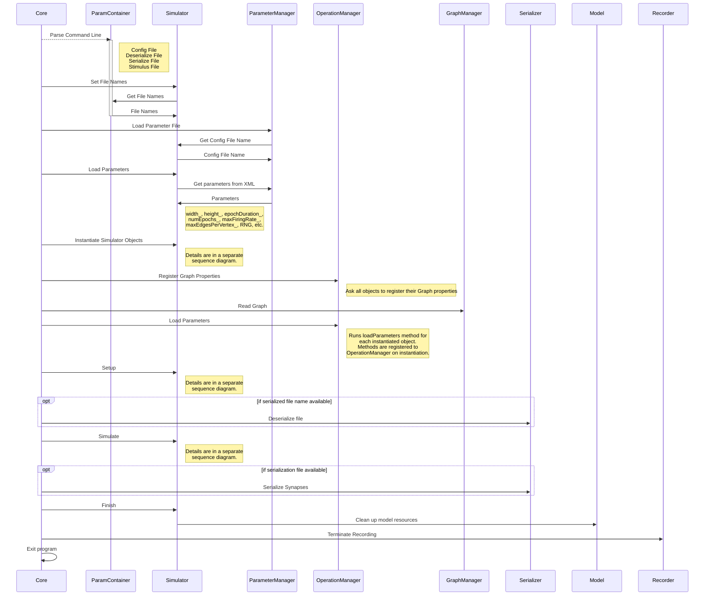
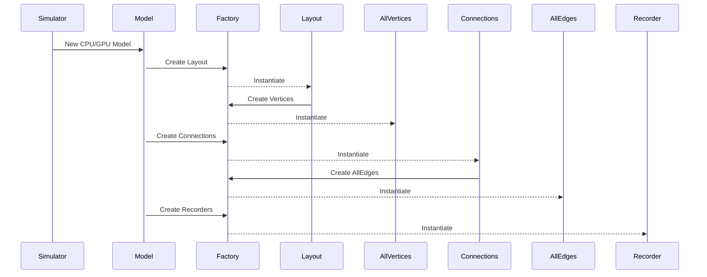
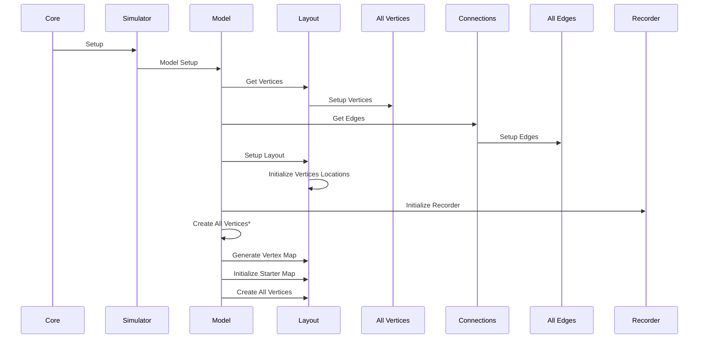
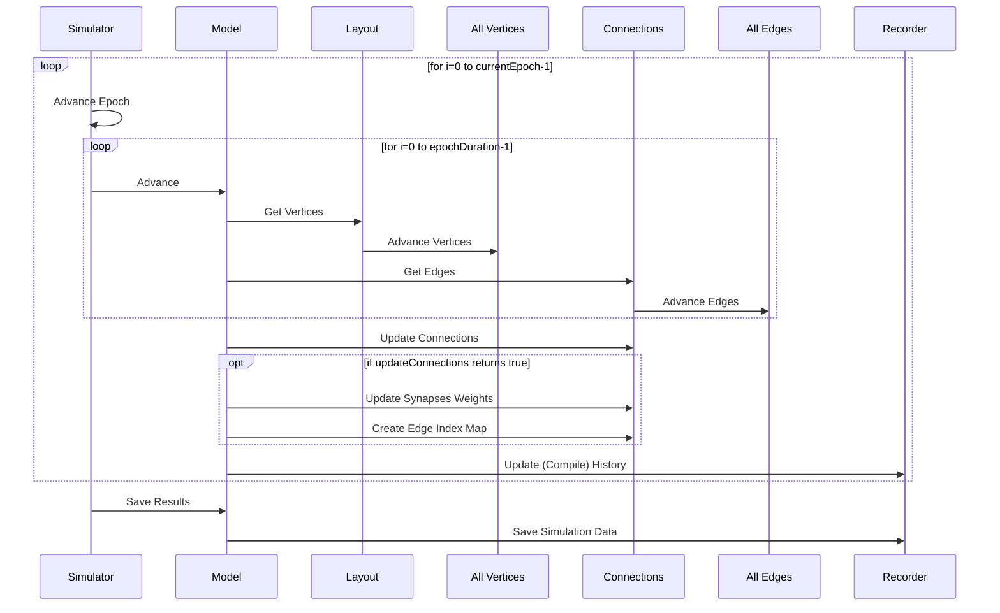
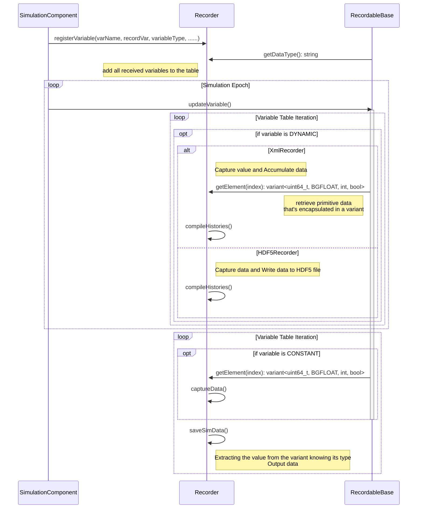

# Graphitti Top-level Sequence Diagram

The following is a Diagram of the top-level simulator execution sequence. The object creation and simulation execution sequences are presented in separate diagrams.

# Simulator Objects Creating Sequence Diagram

Graphitti uses the Factory Method and Singleton design patterns for instantiating the object types defined in the configuration file.

# Simulator Setup Sequence Diagram

This Diagram represents an overview of the setup sequence.

# Simulation Sequence Diagram

This Diagram represents an overview of the simulation process execution sequence.

# Recorder Sequence Diagram

This Diagram represents an overview of the recorder sequence.

